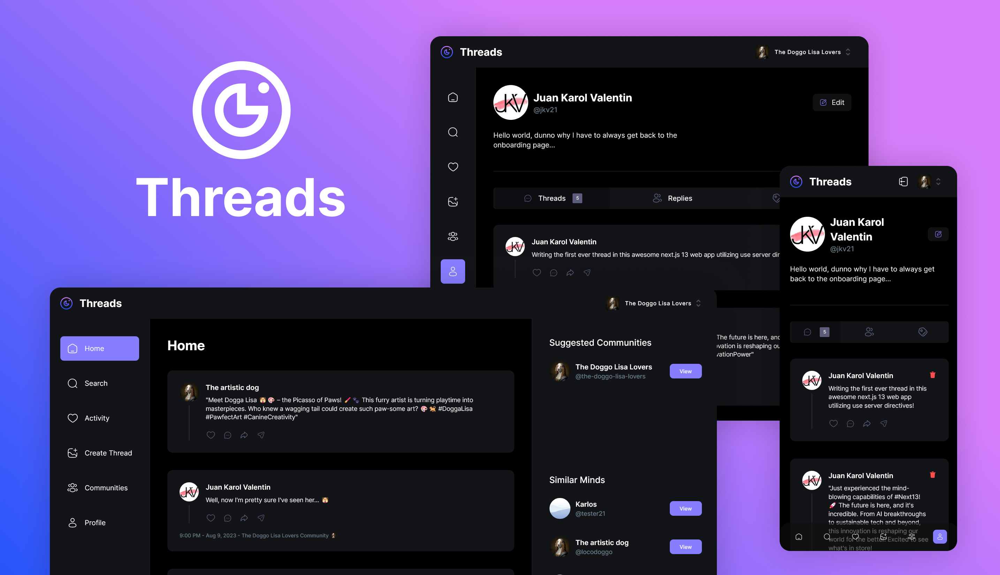

# Threads

> A modern [Next.js](https://nextjs.org/) web application for creating a social media platform, built with React, TypeScript, and Tailwind CSS.


---

## 📸 Preview



---

## ✨ Features

- **User Authentication:** Secure user authentication with Clerk.
- **Onboarding:** A guided onboarding process for new users.
- **Thread Creation:** Users can create, and post new threads.
- **Commenting:** Users can comment on threads.
- **Communities:** Users can create and join communities.
- **Activity Feed:** Users can view their recent activity.
- **Search:** Users can search for other users and communities.
- **User Profiles:** View user profiles with a list of their submitted threads.
- **Responsive Design:** Fully accessible on desktop and mobile devices.

---

## 🚀 Live Demo

Check out the live version here:
**[🔗 Live Project](https://threads-jkv21.vercel.app/)**

---

## 🛠️ Tech Stack

- **Framework:** [Next.js](https://nextjs.org/) `^13`
- **UI Library:** [React](https://react.dev/) `18`
- **Language:** [TypeScript](https://www.typescriptlang.org/) `^5`
- **Styling:** [Tailwind CSS](https://tailwindcss.com/) `^3.3.3`
- **Database:** [MongoDB](https://www.mongodb.com/) with [Mongoose](https://mongoosejs.com/)
- **Authentication:** [Clerk](https://clerk.com/)
- **File Uploads:** [UploadThing](https://uploadthing.com/)
- **Deployment:** [Vercel](https://vercel.com/)

---

## 📁 Project Structure

```bash
├─ app/                # Next.js App Router pages & API routes
│  ├─ (auth)/          # Authentication pages
│  ├─ (root)/          # Root layout and pages
│  └─ api/             # API routes
├─ components/         # Reusable UI components
├─ constants/          # Constants used in the application
├─ lib/                # Utility functions / helpers
│  ├─ actions/         # Server-side actions
│  ├─ models/          # Mongoose models
│  └─ validations/     # Zod validation schemas
├─ public/             # Static assets (images, icons, etc.)
└─ ...
```

---

## ⚙️ Getting Started

### ✅ Prerequisites

* Node.js (v18.x or later)
* npm / yarn / pnpm
* MongoDB

### 🧰 Installation

1. Clone the repository:

   ```bash
   git clone https://github.com/jkvdev/Threads.git
   ```
2. Navigate to the project directory:

   ```bash
   cd Threads
   ```
3. Install the dependencies:

   ```bash
   npm install
   ```

### 🔐 Environment Variables

This project requires environment variables. Create a `.env.local` file in the root and add:

```env
NEXT_PUBLIC_CLERK_PUBLISHABLE_KEY=
CLERK_SECRET_KEY=
NEXT_PUBLIC_CLERK_SIGN_IN_URL=/sign-in
NEXT_PUBLIC_CLERK_SIGN_UP_URL=/sign-up
NEXT_PUBLIC_CLERK_AFTER_SIGN_IN_URL=/
NEXT_PUBLIC_CLERK_AFTER_SIGN_UP_URL=/onboarding
MONGODB_URL=
UPLOADTHING_SECRET=
UPLOADTHING_APP_ID=
```

### ▶️ Running the Development Server

```bash
npm run dev
```

Visit [http://localhost:3000](http://localhost:3000) to view it in your browser.

---

## 💡 Key Learnings & Challenges

* Used **server-side rendering (SSR)** for optimal performance.
* Implemented the new **Next.js App Router**.
* Integrated a **MongoDB** database with **Mongoose**.
* Secured the application with **Clerk** for user authentication.
* Focused on accessibility and responsive design across devices.

---

## 🗺️ Roadmap

* [ ] Implement Update functionality for threads and comments
* [ ] Add light mode support
* [ ] Improve Lighthouse performance score
* [ ] Add unit and integration tests
* [ ] Expand API integrations

---

## 📝 License

This project is licensed under the MIT License. See the [LICENSE](LICENSE) file for details.

---

## 📬 Contact

**Valentin Costea** – [Portfolio](https://jkvdev.com) – [jkv21contact@gmail.com](mailto:jkv21contact@gmail.com)
